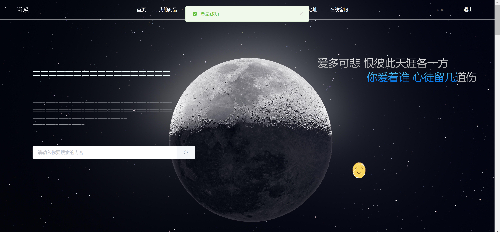
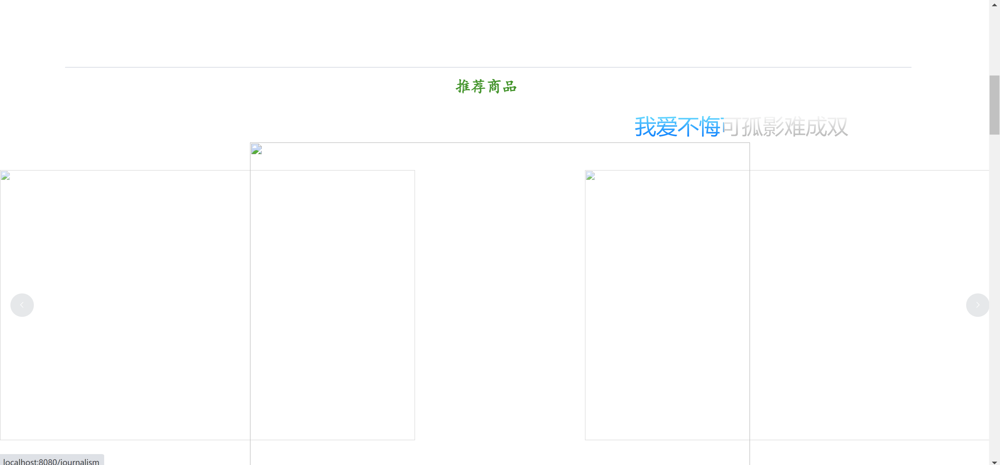
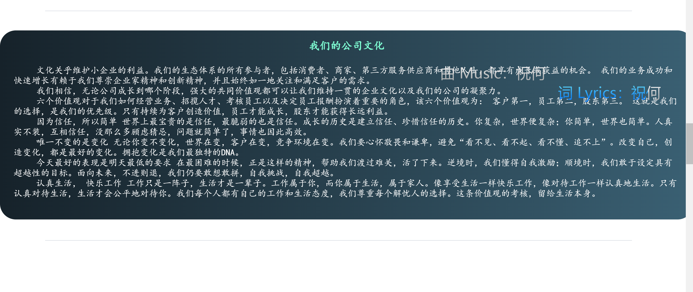
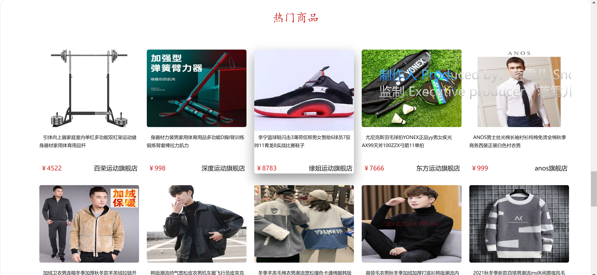
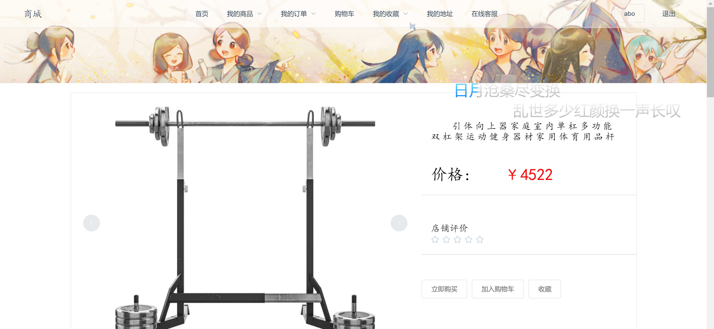
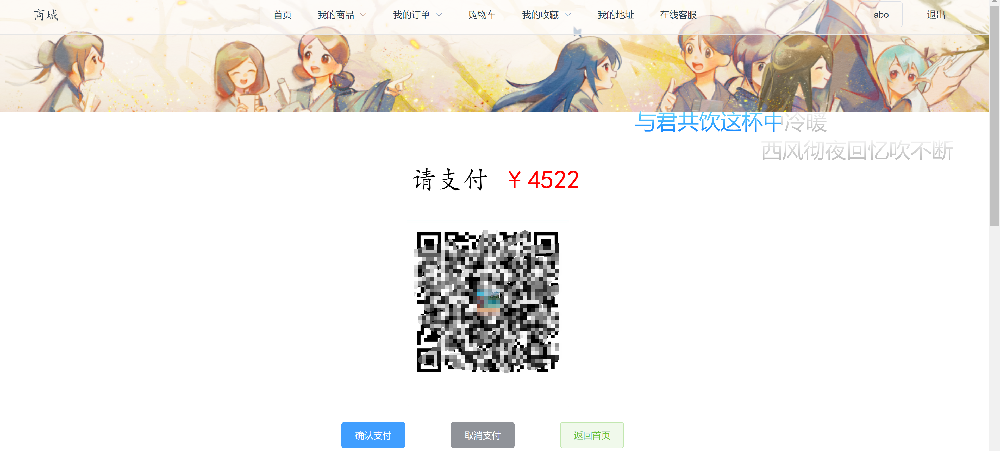
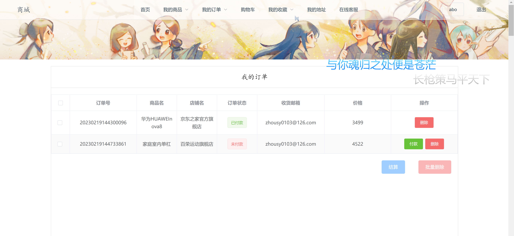
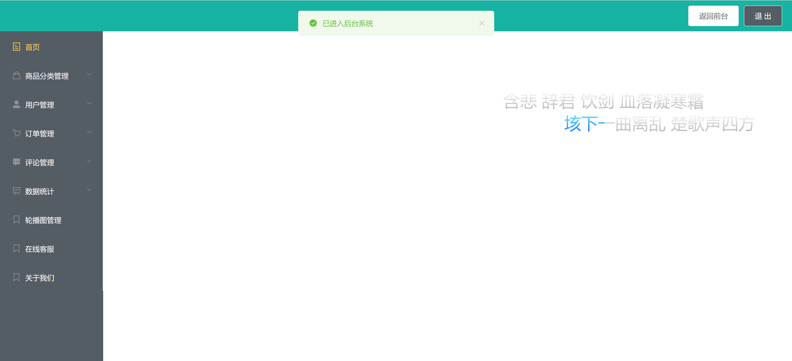
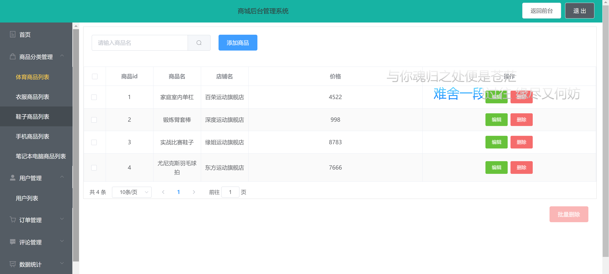
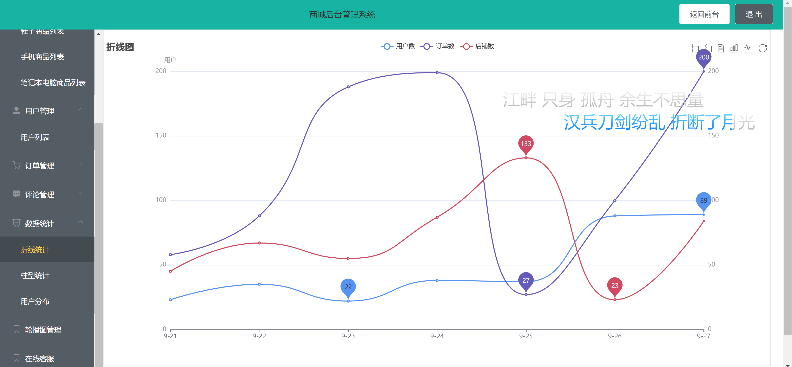

<h1 align="center">商城管理系统</h1>

## 简介
商城管理系统：角色分为管理员、用户；功能包括商品展示、订单管理、用户注册登录、推荐商品、支付页面、评论管理以及数据统计，支持个性化购物和后台优化运营。    --计算机毕业设计源码；毕设源码；java毕业设计源码

## 联系方式

<h3 align="center">获取完整代码与数据库文件 + 微信：bysj5151 QQ: 86050149 QQ群: 783742310</h3>

<h3 align="center">可帮忙远程部署 包运行成功！提供远程部署、修改代码、设计文档指导、代码讲解等服务！</h3>

## 功能介绍（完整见运行截图）
管理员：管理商城的功能，包括商品分类管理、用户管理、订单管理、评论管理和数据统计。可以编辑、删除商品，设置轮播图，处理订单，查看和分析销售数据，进行用户支持等任务。提供后台管理界面入口和方便的导航选项，以高效操作和优化商城运营。

用户：具备在线浏览、搜索商品的能力，并能查看商品详情，加入购物车、收藏商品，进行支付操作，查看和管理订单。用户可以注册和登录个人账户，以享受个性化购物体验，包括更改个人信息，保存收货地址，查看历史订单状态。操作界面直观，方便用户进行购买和订单管理。

前台界面：商城首页配有导航栏、轮播图和商品推荐模块，帮助用户快速访问不同商品。热门商品区帮助用户快速浏览畅销商品。用户在登录后能查看欢迎信息，使用搜索框快速查找商品。页面设计简洁，配有宣传标语和视觉效果增强用户体验。

后台界面：简洁明了，功能模块包括首页、商品分类管理、用户管理、订单管理、评论管理等。管理员可通过导航栏高效访问各管理模块，进行诸如商品编辑、用户信息维护、订单处理等管理任务，帮助提升商城整体运营效率。

## 运行截图

本代码来源于网络,仅供学习参考使用!

